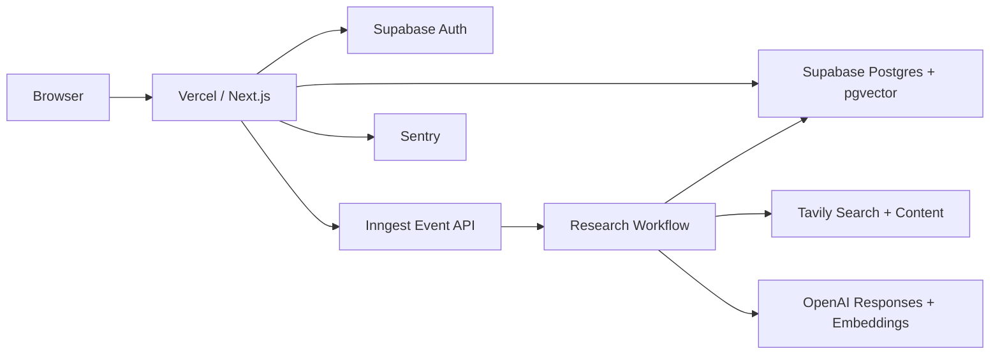

# 个人作品集与 Evidence Graph 总方案

> 日期：2026-07-15
> 状态：决策已完成，可直接进入实施
> 目标：先用最小投入上线个人作品集，再把 Evidence Graph 做成作品集主项目、公开可用产品和后续商业验证入口。

## 1. 最终决策

采用“一个仓库、一个应用、一个主域名、一个连续交付流程”：

1. 新建独立仓库 `evidence-graph`，不混入现有 `ai-photo-studio-cn` 或 `projectpilot-ai`。
2. 使用一个 Next.js 应用同时承载：
   - `/`：个人作品集首页。
   - `/work`：项目案例列表。
   - `/work/[slug]`：项目案例详情。
   - `/notes`：工程文章和研究记录。
   - `/evidence`：Evidence Graph 产品入口。
   - `/app`：登录后的研究工作台。
   - `/r/[slug]`：公开、只读、可分享的证据报告。
3. 作品集在第 2 个开发日上线，之后停止非必要美化。
4. Evidence Graph 是未来四周唯一主项目，CyberVerse 暂不实施。
5. 线上采用 Vercel + Supabase + Inngest 的成熟托管组合，不自建服务器、不维护 Kubernetes、不购买 GPU。
6. MVP 不接支付，不做团队协作，不做浏览器扩展，不做本地模型部署。

成功状态不是“网站做完”，而是：任何访客能从个人首页进入 Evidence Graph，运行一次研究，检查每条结论的原文证据，并打开一份公开案例。

## 2. 为什么采用这一方案

### 2.1 选择方案 A：Vercel + Supabase + Inngest

这是最终采用方案。

| 模块 | 选择 | 原因 |
| --- | --- | --- |
| Web 与 API | Next.js + Vercel | GitHub 导入后自动构建、Preview、回滚和域名绑定成熟 |
| 数据库 | Supabase Postgres | 同时提供 Postgres、Auth、RLS 和 pgvector |
| 登录 | Supabase Auth + GitHub OAuth | 作品集受众与开发者产品匹配，不单独维护密码系统 |
| 长任务 | Inngest | 适合搜索、抓取、抽取、综合等多步骤任务，支持重试和步骤恢复 |
| 搜索与正文 | Tavily Search | MVP 用单一接口获得搜索结果和正文，减少抓取服务数量 |
| LLM | OpenAI Responses API | `gpt-5.6-luna` 处理高频抽取，`gpt-5.6-terra` 处理冲突和报告综合 |
| 向量检索 | Supabase pgvector | 避免额外引入 Pinecone/Qdrant |
| 图谱界面 | Cytoscape.js | 使用成熟图库处理布局、缩放、选择和大图性能 |
| 错误监控 | Sentry | Vercel Marketplace 可直接接入，覆盖前后端异常 |
| 产品分析 | Vercel Web Analytics | 先获取访问和转化数据，不接复杂埋点平台 |

官方能力依据：

- [Vercel Deploy Button](https://vercel.com/docs/deployments/deploy-button)
- [Supabase for Vercel](https://vercel.com/marketplace/supabase)
- [Supabase Auth](https://supabase.com/docs/guides/auth)
- [Supabase pgvector](https://supabase.com/docs/guides/database/extensions/pgvector)
- [Inngest on Vercel](https://www.inngest.com/docs/deploy/vercel)
- [Tavily Search API](https://docs.tavily.com/documentation/api-reference/endpoint/search)
- [OpenAI GPT-5.6 model guidance](https://developers.openai.com/api/docs/guides/latest-model.md)
- [Sentry for Vercel](https://vercel.com/marketplace/sentry)

### 2.2 未采用方案

**Railway 全栈部署**

优点是应用、Worker 和 Postgres 可以放在一个平台。未采用的原因是 Auth、对象存储、向量扩展和数据库权限仍需自行组合，最终并没有比 Supabase 方案少多少运维。

**Cloudflare Workers + D1 + Queues**

优点是成本低、全球边缘性能好。未采用的原因是 Evidence Graph 有长时间 AI 工作流、较大正文和 Postgres 向量查询，迁就 Workers/D1 会增加架构复杂度。

**单台 VPS + Docker Compose**

成本可控，但需要维护 TLS、数据库备份、进程、日志、安全升级和故障恢复，不符合“一键部署、个人开发者聚焦产品”的目标。

## 3. 产品定位

### 3.1 一句话定义

Evidence Graph 是一个“可追溯的 AI 研究工作台”：它把搜索结果拆成 Claim、Evidence 和 Source，并明确标记支持、反驳、限定和冲突关系。

### 3.2 目标用户

MVP 只服务一类核心用户：需要快速做技术、产品或市场调研，但不愿接受无来源 AI 总结的独立开发者和产品工程师。

### 3.3 核心任务

用户输入一个研究问题后，需要完成以下闭环：

```text
输入问题
→ 搜索与收集来源
→ 提取可核查主张
→ 关联原文证据
→ 展示支持、反驳和限定关系
→ 人工接受或拒绝
→ 生成带引用报告
→ 发布只读分享页
```

### 3.4 与 Codex/ChatGPT 搜索总结的本质区别

| 普通搜索总结 | Evidence Graph |
| --- | --- |
| 面向单次回答 | 面向可持续研究项目 |
| 结论主要存在于自然语言段落 | Claim 是可审核的数据实体 |
| 引用常停留在页面级 | 引用定位到保存的原文片段 |
| 支持与反驳混在总结里 | 关系被显式建模 |
| 修改问题后重新生成 | 研究版本、来源和审核记录可保留 |
| 难以共享完整推理依据 | 可发布只读证据报告 |

## 4. MVP 产品范围

### 4.1 必须完成

1. GitHub 登录。
2. 新建研究项目：标题、研究问题、语言。
3. 自动搜索 8-12 个来源，支持额外粘贴最多 5 个 URL。
4. 保存来源正文、作者、日期、域名、抓取时间和内容哈希。
5. 从来源中抽取 Claim。
6. 将原文片段关联为 `supports`、`rebuts`、`qualifies` 或 `context`。
7. 展示 Claim 列表、证据关系图和原文查看器。
8. 用户接受、拒绝或保留待确认的 Claim。
9. 生成所有事实段落都有引用的 Markdown 报告。
10. 发布或撤销公开分享页。
11. 展示研究运行步骤、失败原因、Token、搜索量和估算成本。
12. 提供一份无需登录的完整公开示例。

### 4.2 明确不做

- 团队成员、组织和权限邀请。
- 订阅支付和积分购买。
- PDF、Office、图片 OCR 上传。
- 浏览器扩展。
- 自动定时监控和邮件提醒。
- 通用聊天机器人。
- 用户自定义 Agent、MCP 或任意工具执行。
- 自动给来源打“真/假”分数。
- 本地 LLM、自托管搜索或 GPU 推理。

这些能力只有在 MVP 有真实使用数据后才进入下一阶段。

## 5. 作品集方案

### 5.1 信息架构

作品集不是独立营销站，而是同一产品中的公开层：

| 页面 | 内容 |
| --- | --- |
| 首页 | 个人名称、定位、Evidence Graph 主项目、精选工作、工程文章、联系方式 |
| Work | Evidence Graph、AI Photo Studio CN |
| Case Study | 问题、约束、架构、关键决策、验证结果、截图和代码链接 |
| Notes | 研究方法、Agent 工程、失败复盘和技术文章 |
| Evidence | 直接进入可用产品，不做第二套冗长营销首页 |

### 5.2 首页内容顺序

1. 第一屏显示个人名称和“独立开发者 / AI 产品工程”定位。
2. 背景使用真实 Evidence Graph 工作台截图；产品未完成前使用 AI Photo Studio CN 的真实界面，不使用抽象插画。
3. 第一屏高度控制在 72-82vh，必须露出下一段 Selected Work。
4. Evidence Graph 作为第一个项目，显示真实状态：`Building`、`Private beta` 或 `Live`。
5. AI Photo Studio CN 强调完整生成任务、Provider 安全门禁、重试和测试闭环。
6. 最后是简短 About、GitHub 和邮箱，不添加空泛自我评价。

### 5.3 视觉方向

- 中文默认，英文通过 `/en` 提供完整镜像内容。
- 浅灰白背景、近黑正文、暗红操作色、青绿色状态色。
- 不使用紫蓝渐变、装饰光球、大圆角卡片和营销式功能宫格。
- 作品集部分偏编辑排版，应用部分偏安静、紧凑的工作台。
- 卡片圆角不超过 6px；主要区域使用分栏、表格、列表和画布，而不是卡片套卡片。
- 图谱不是背景装饰，节点点击必须能驱动证据和原文面板。

## 6. Evidence Graph 页面与交互

### 6.1 页面清单

| 路由 | 作用 |
| --- | --- |
| `/evidence` | 产品入口、公开示例和登录按钮 |
| `/app` | 最近项目、运行状态、配额和创建入口 |
| `/app/research/new` | 输入研究问题和补充 URL |
| `/app/research/[id]` | 研究工作台 |
| `/app/settings` | 个人信息、删除数据和语言 |
| `/r/[slug]` | 公开报告与证据图，只读 |

`/evidence`、`/app` 及其子路由挂在 `[locale]` 前缀下，跟随站点语言切换。`/r/[slug]` 不挂 locale 前缀：报告在生成时按研究提问所用语言写死为单语言快照，分享链接与访问者当前站点语言无关，保证同一个链接发给任何人打开都是同一份内容。MVP 不做报告翻译或双语版本；如果研究问题用中文提出，报告就是中文快照。

### 6.2 研究工作台

桌面端采用固定三栏：

1. 左栏：Claim 列表、状态筛选、支持/反驳计数。
2. 中栏：关系图或报告视图，通过 Tabs 切换。
3. 右栏：选中证据的原文、来源元数据和打开原网页操作。

底部保留可收起的 Run Log，展示当前步骤和失败信息。移动端不压缩成三栏，而是使用 `Claims / Graph / Source / Log` 四个 Tabs。

### 6.3 Claim 审核

每条 Claim 具有三种人工状态：

- `pending`：模型提取，尚未审核。
- `accepted`：用户确认可以进入最终报告。
- `rejected`：提取错误、重复或证据不足。

系统永远保留模型结果和人工状态，不用人工修改覆盖原始记录。

## 7. 研究工作流

### 7.1 状态机

```text
queued
→ planning
→ searching
→ collecting
→ indexing
→ extracting_claims
→ linking_evidence
→ detecting_conflicts
→ drafting_report
→ ready
```

终止状态为 `ready`、`failed` 或 `cancelled`。

### 7.2 每一步职责

1. **Planning**：把问题拆成 3-5 个搜索子问题，不生成答案。
2. **Searching**：每个子问题搜索候选来源，合并后限制为 12 个。
3. **Collecting**：规范 URL、去重、保存正文和元数据。
4. **Indexing**：按 800-1200 字符切块并写入 embedding。
5. **Extracting Claims**：使用 JSON Schema 输出独立、可证伪、带限定条件的 Claim。
6. **Linking Evidence**：只允许引用数据库里存在的片段。
7. **Detecting Conflicts**：建立 Claim 间 `contradicts`、`duplicates`、`depends_on` 关系。
8. **Drafting Report**：只使用已建立 Evidence Link 的 Claim 生成报告。

### 7.3 关键正确性约束

- `quote` 必须是保存正文的精确子串，否则 Evidence Link 拒绝入库。
- 一个事实型报告段落没有 Citation 就不能发布。
- “反驳”证据不会被综合过程静默删除。
- 来源不使用不透明的真实性总分，只展示作者、时间、来源类型、是否为一手资料等可观察信息。
- 同一运行的网络步骤最多重试 3 次，模型步骤通过幂等键避免重复扣费。
- 单次运行最多 12 个搜索来源、5 个手动 URL、20 万正文字符。
- 单用户同时只允许 1 个活跃运行。
- 单次运行达到 1 美元估算成本立即停止，并展示原因。

## 8. 技术架构



### 8.1 技术栈

- Next.js App Router、React、TypeScript。
- Tailwind CSS、Radix/shadcn primitives、Lucide Icons。
- `next-intl` 处理中文和英文。
- Supabase JS/SSR，不通过浏览器暴露 Service Role。
- Zod 定义输入和 Provider 输出边界。
- Cytoscape.js 负责图谱画布。
- Inngest step functions 负责研究任务。
- `gpt-5.6-luna` 使用低推理强度完成搜索计划、Claim 抽取和 Evidence Link；`gpt-5.6-terra` 使用中等推理强度完成冲突判断和最终报告。
- `text-embedding-3-small` 生成 1536 维向量；模型名和维度写入 Chunk，未来升级时不原地混用向量。
- Vitest、Testing Library、Playwright。
- Sentry、Vercel Analytics。

### 8.2 Provider 边界

内部定义三个接口：

- `SearchProvider.search(query, options)`
- `LanguageModel.generateStructured(schema, input)`
- `EmbeddingProvider.embed(texts)`

MVP 默认实现 Tavily 和 OpenAI，但领域逻辑不直接依赖它们，便于以后替换供应商。

## 9. 数据模型

### 9.1 核心表

| 表 | 关键字段与职责 |
| --- | --- |
| `profiles` | `id` 对应 Auth User，保存显示名、语言和 GitHub 用户名 |
| `projects` | 所有者、标题、问题、状态、可见性、公开 slug |
| `research_runs` | 运行状态、当前步骤、配置、Token、搜索量、成本、错误 |
| `sources` | 规范 URL、标题、作者、日期、域名、正文、哈希、抓取时间 |
| `source_chunks` | 来源片段、顺序、位置元数据、embedding |
| `claims` | Statement、类型、限定条件、模型置信度、人工状态 |
| `evidence_links` | Claim、Chunk、关系、强度、精确 Quote、模型理由 |
| `claim_relations` | Claim 间冲突、依赖、重复关系 |
| `reports` | Markdown、引用快照、版本、发布时间 |
| `usage_monthly` | 用户月份、运行次数、搜索量、Token 和估算成本 |
| `audit_events` | 发布、撤销、审核、删除等用户可追踪动作 |

### 9.2 关键索引

- `sources(project_id, canonical_url)` 唯一索引。
- `sources(content_hash)` 去重索引。
- `claims(project_id, normalized_key)`。
- `evidence_links(claim_id, chunk_id, relation)` 唯一索引。
- `source_chunks.embedding` 使用 pgvector HNSW 索引。
- `projects(owner_id, updated_at desc)`。
- `research_runs(project_id, created_at desc)`。

### 9.3 数据权限

- 所有用户数据表启用 RLS。
- 用户只能访问 `owner_id = auth.uid()` 的项目数据。
- `/r/[slug]` 只能读取 `visibility = public` 且当前发布的 Report 快照。
- Inngest 使用 Service Role，但每个事件必须携带 `owner_id` 与 `project_id`，工作流开始时再次核对所有权。
- 删除项目必须级联删除来源正文、向量、Claim、报告和审计可识别内容。

## 10. 目录结构

```text
evidence-graph/
├── app/
│   ├── [locale]/
│   │   ├── (portfolio)/
│   │   ├── evidence/
│   │   └── app/
│   ├── r/[slug]/
│   └── api/inngest/route.ts
├── src/
│   ├── features/portfolio/
│   ├── features/projects/
│   ├── features/research/
│   ├── features/sources/
│   ├── features/claims/
│   ├── features/reports/
│   ├── providers/search/
│   ├── providers/llm/
│   ├── inngest/functions/
│   ├── lib/supabase/
│   ├── lib/auth/
│   ├── lib/usage/
│   └── i18n/
├── supabase/
│   ├── migrations/
│   └── seed.sql
├── tests/
│   ├── unit/
│   ├── integration/
│   ├── evals/
│   └── e2e/
├── public/
│   └── work/
├── .github/workflows/ci.yml
├── .env.example
└── README.md
```

领域目录包含组件、服务、Schema 和测试，避免形成一个超大的 `lib/ai.ts` 或页面文件。

## 11. 实施计划

### 阶段 0：仓库与作品集上线，2 天

交付：

- 新建 GitHub 仓库和 Next.js 工程。
- 建立设计 Token、中文/英文路由和全局布局。
- 完成首页、Work、Case Study、Notes 空状态。
- 使用现有两个项目的真实截图和已验证内容。
- 配置 Vercel Preview、Production 和自定义域名。

验收：

- 320、390、1024、1440px 无横向溢出。
- 首页第一屏能说明身份和主要方向。
- 三个项目都有真实状态，不虚构线上用户或收入。
- `lint`、`typecheck`、`build`、Playwright smoke 全部通过。

### 阶段 1：应用骨架、Auth 和数据库，3 天

交付：

- Supabase 项目、迁移、GitHub OAuth、RLS。
- Dashboard、新建研究、研究空工作台。
- 项目 CRUD 和每月使用计数。
- 公开示例项目 Seed。

验收：

- 未登录用户不能访问 `/app`。
- A 用户不能读取 B 用户项目，集成测试验证 RLS。
- 示例报告无需登录可打开，但不能修改。

### 阶段 2：研究工作流，5 天

交付：

- Inngest 状态机。
- Tavily 搜索、正文保存、URL 规范化和去重。
- Chunk、Embedding、Claim 抽取和 Evidence Link。
- 精确 Quote 校验、冲突检测、成本硬限制。
- 失败重试和 Run Log。

验收：

- 用固定 Fixture 可重复生成相同核心 Claim。
- 非精确 Quote 无法入库。
- Provider 超时后能从失败步骤重试，不重复已有步骤。
- 达到配额或成本上限时不再调用外部 Provider。

### 阶段 3：证据工作台，5 天

交付：

- Claim 列表、图谱、来源查看器和运行日志。
- Claim 接受/拒绝。
- 支持、反驳、限定、上下文关系筛选。
- 移动端 Tabs。
- 键盘可访问性和加载/失败/空状态。

验收：

- 点击节点会定位对应 Claim、证据和原文。
- 最长标题、URL、Quote 不破坏布局。
- 图谱 200 节点仍可交互，不因标签改变布局尺寸。

### 阶段 4：报告、公开案例和作品集回填，3 天

交付：

- 引用报告生成、发布、撤销和版本快照。
- 公开分享页 SEO、Open Graph 和打印样式。
- 至少 3 个真实研究案例。
- 首页换成 Evidence Graph 真实工作台媒体。
- 完成 Evidence Graph Case Study。

验收：

- 公开报告每个事实段落至少包含一个可打开引用。
- 被撤销的 slug 返回 404。
- 分享页不暴露用户私有运行日志和 Provider 成本详情。

### 阶段 5：上线门禁，2 天

交付：

- GitHub Actions CI。
- Sentry、Analytics、结构化日志。
- CSP、安全 Header、删除账号流程、备份说明。
- 私有仓库使用 Vercel Git Import 的一键部署文档；源码未来公开时再增加 Deploy Button。
- Production smoke 和回滚演练。

验收：

- PR 必须通过 lint、typecheck、unit、integration、build 和关键 e2e。
- Production 创建一次真实研究并发布成功。
- Sentry 能收到一次受控测试异常。
- 从上一稳定 Vercel Deployment 回滚成功。

总周期：20 个专注开发日，按四周安排。作品集第 2 天可访问，Evidence Graph 第 18-20 天进入公开 Beta。

## 12. 测试与评测标准

### 12.1 自动化测试

- Unit：URL 规范化、内容哈希、切块、Schema、Quote 校验、Citation 校验、配额和成本计算。
- Integration：RLS、级联删除、幂等运行、Provider Fixture、发布快照。
- E2E：登录、新建研究、运行、审核 Claim、发布、撤销、跨用户隔离。
- Visual：桌面/移动工作台、长文本、失败态、200 节点图谱。

日常 CI 全部使用 Provider Fixture，不调用真实 OpenAI/Tavily，不产生费用。真实 Provider 只通过有确认口令和预算上限的专用 smoke 命令调用。

### 12.2 Evidence Eval

建立 10 个固定研究问题和人工核验样本，至少覆盖技术选型、产品竞品和市场事实。

MVP 上线门槛：

| 指标 | 门槛 |
| --- | ---: |
| Quote 是原文精确子串 | 100% |
| 公开报告无引用事实段落 | 0 |
| 抽样 Evidence Relation 准确率 | >= 90% |
| 可用场景下来源域名数 | >= 4 |
| 真实运行完成率 | >= 90% |
| 单次运行硬成本 | <= 1 美元 |

## 13. 安全与成本控制

1. OpenAI、Tavily、Supabase Service Role、Inngest Signing Key 只存在于服务端环境变量。
2. Markdown 使用白名单渲染，禁止任意 HTML 和脚本。
3. 不直接由服务器抓取用户任意内网 URL；MVP 统一通过搜索内容 Provider，降低 SSRF 风险。
4. GitHub OAuth 回调域名只允许 Preview 白名单和 Production 域名。
5. 免费账户每月 3 次研究，每次最多 12 个来源。
6. 达到 80% 月度总预算时通知，达到 100% 时关闭新研究但保留读取。
7. 所有真实 Provider 测试必须显式设置一次性确认变量。
8. 数据库每日备份使用 Supabase 托管能力；公开 Beta 前至少做一次恢复演练。
9. 每次 OpenAI 请求携带由内部用户 ID 单向哈希得到的稳定 `safety_identifier`，不发送邮箱或 GitHub 用户名。

## 14. 上线成本

### 14.1 开发与私测

| 项目 | 预算 |
| --- | ---: |
| 域名 | 每年约 10-30 美元 |
| Vercel | 个人非商业阶段使用免费计划 |
| Supabase | 免费计划 |
| Inngest | 免费开发计划 |
| Sentry | 免费计划 |
| OpenAI | 首期充值 20 美元并设置月上限 |
| Tavily | 先使用开发额度，不足后按用量升级 |

### 14.2 公开 Beta

准备每月 65-145 美元预算：Vercel/Supabase 付费档加搜索和模型调用。具体价格在购买当天按官方页面重新确认，不把会变化的套餐价格写死进代码或商业承诺。

### 14.3 付费验证条件

MVP 不立即接支付。满足以下条件后才做 Pro：

- 至少 20 名非熟人用户完成研究。
- 至少 5 人一周内再次使用。
- 至少 3 人主动提出更多运行、导出或监控需求。

届时首个付费版本只提供更多研究次数、导出和定时刷新，不扩成通用 Agent 平台。

## 15. 首批公开案例

上线必须带着内容，而不是空数据库：

1. `CyberVerse 是否适合个人开发者作为商业产品底座？`
2. `Evidence Graph 与普通 AI 搜索总结的差异是什么？`
3. `Vercel、Railway、Cloudflare 哪个更适合长时间 AI 研究工作流？`

每个案例同时产出：公开 Evidence Graph、800-1500 字案例文章、架构或决策图、失败与修正记录。这三份内容也是作品集的第一批 Notes。

## 16. 部署流程

1. GitHub 创建 `evidence-graph` 私有仓库，连接 Vercel。
2. 在 Vercel Marketplace 创建或连接 Supabase，注入公开连接变量。
3. 配置 Supabase GitHub OAuth 和 Production/Preview 回调 URL。
4. 通过 Supabase CLI 执行迁移；后续 main 分支迁移由 GitHub Actions 执行。
5. 在 Vercel 导入 Inngest Integration，发布 `/api/inngest`。
6. 添加 OpenAI、Tavily、Supabase Service Role 和 Inngest Secret。
7. 添加 Sentry Integration。
8. 绑定主域名，Cloudflare 只负责 DNS 和基础保护。
9. 运行 Production smoke：登录、研究、审核、发布、撤销。
10. 固定成功 Deployment 为回滚基线。

该方案对海外和全球访问优先，国内访问属于尽力支持。若以后要求中国大陆稳定访问，需要备案域名和国内云部署，这是独立基础设施阶段，不在本次一键部署范围内。

## 17. 你需要提供的内容

### 17.1 开发开始前必须提供

1. 作品集品牌暂定为 `Ailian`，以后提供正式中英文姓名时再替换。
2. 职业定位使用“资深前端开发工程师，正在扩展全栈与 Agent 工程能力”。
3. GitHub 使用 `Ailian0206`，允许创建新的项目仓库。
4. 对外联系邮箱使用 `airenglian@gmail.com`。
5. AI Photo Studio CN 可以公开展示源码、截图和架构说明；ProjectPilot AI 不纳入作品集。

### 17.2 接入真实研究前必须提供

1. OpenAI API Key，并在账户侧设置月度预算上限。
2. Tavily API Key。
3. 允许执行一次小额真实 Provider smoke；日常测试不会外呼。

### 17.3 正式上线前必须提供或授权

1. 一个主域名，推荐格式为 `姓名.dev` 或 `姓名.com`；在知道名字后再检查实际可注册域名。
2. Vercel、Supabase、Inngest、Sentry 账号，全部建议通过同一个 GitHub 登录。
3. Vercel 和 Supabase 项目授权。
4. GitHub OAuth App 的创建权限或 Client ID/Secret。
5. Cloudflare DNS 授权，或由你按我给出的 DNS 记录操作。

不需要提供 GPU、云服务器、Redis、独立向量数据库或运维人员。

## 18. 决策边界

以下内容已经定稿，不再要求产品决策：技术栈、部署平台、页面结构、MVP 功能、数据模型、免费配额、视觉方向、测试门槛、Provider 边界和四周顺序。

实施过程中只有以下情况需要再次明确授权：产生真实 API 费用、购买域名或付费套餐、公开个人身份信息、把现有私有项目源码设为公开。其余工程决策按本方案自主推进。
